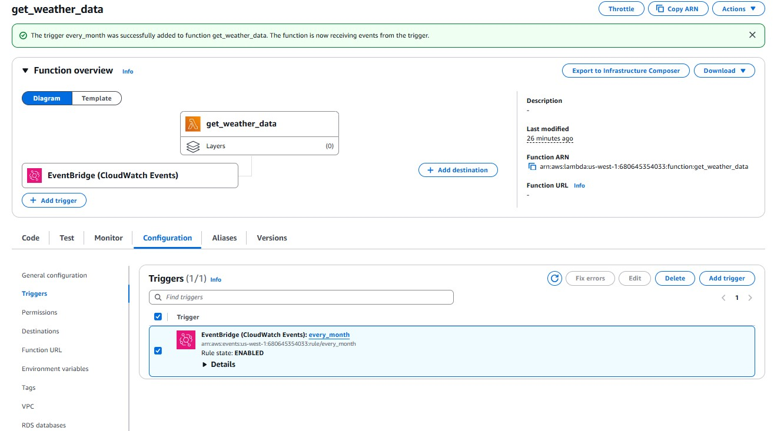
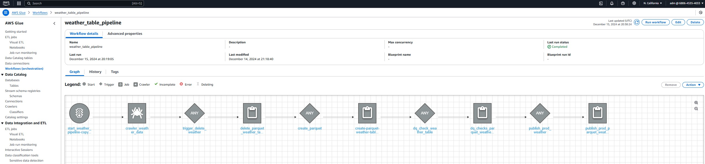
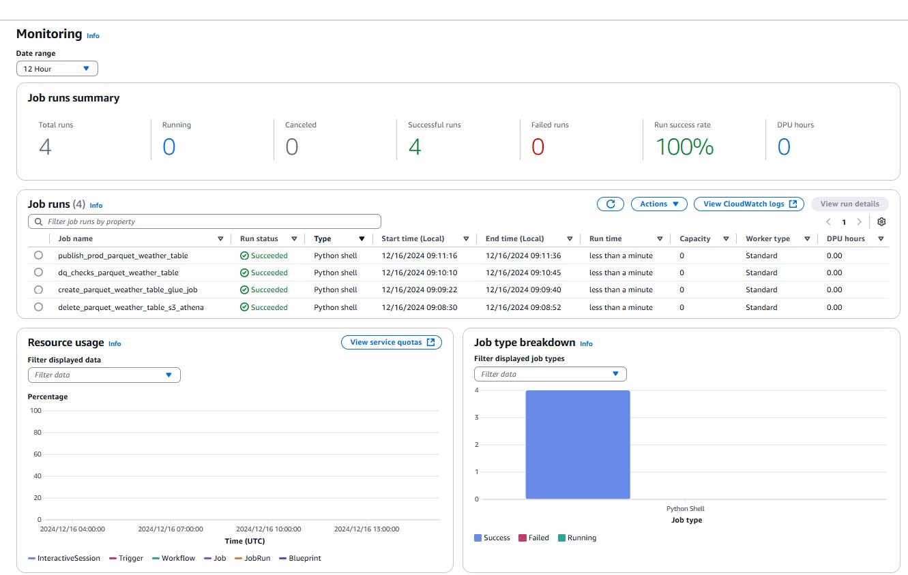
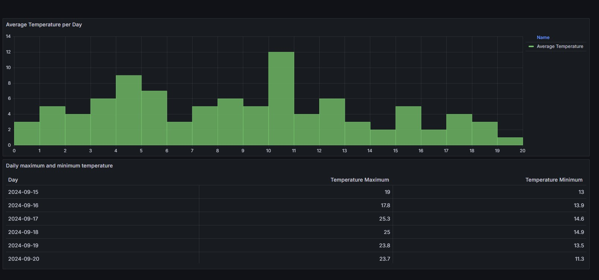

# Project CAPP-AWS: An Exploration of Learning ETL

Author: [Cleber Zumba](https://github.com/cleberzumba)

Last Updated: December 17, 2024

## What is this project for?
This project is a demonstration of how to utilize cloud services to create a data engineering project from scratch. The goals of creating this project include learning about various tools within Amazon Web Services (AWS), how they can be combined to create a compete workflow for extracting, transforming, and loading (ETL) data from online sources, and connect the transformed data to a tool for visualization. 

The main purpose of this project is to expand my knowledge and evolve as a data professional. I decided to align the project with my interests by exploring the Open-Meteo API, which provides weather data such as daily maximum and minimum temperatures. Analyzing weather information not only has practical applications, but also provides an excellent opportunity to improve API integration and data processing skills. This document does not focus on the technical aspects or the code, but rather presents an overview of the project, highlighting the tools used and the reasons that motivated their choice.

## Data Architecture

This project aims to create an automated and scalable data pipeline to collect, process, and visualize weather information. The data source is an external API that provides real-time weather information, such as temperature and geographic location.

The pipeline was developed using AWS managed services, ensuring a serverless and highly available architecture, with a focus on simplicity, performance, and scalability.

  - Extract: Lambda, Firehose, S3, Python, Athena
  - Transform: S3, Athena, Glue
  - Load: S3, Athena, Glue, Grafana
    

## API

This project uses data from the Open-Meteo [website](https://open-meteo.com/) API using the configured URL to collect weather information. The API returns daily maximum and minimum temperatures for Berlin, Germany, for the period June to November 2024.

### Fields Queryed in the URL:

The URL requested the following fields:

  - `latitude` : Latitude of the location - `Value` : 52.52 (corresponds to the latitude of Berlin, Germany).
  - `longitude`: Longitude of the location - `Value` : 13.41 (corresponds to the longitude of Berlin, Germany).
  - `hourly`: Weather parameters in an hourly resolution - `Value` : temperature_2m - `Meaning` : Air temperature at 2 meters above the ground, measured in degrees Celsius (°C).
  - `timezone`: Time zone in which the data will be returned - `Value` : America/Los_Angeles (corresponds to the Pacific time zone).
  - `start_date`: Start date of the forecast or historical range - `Value` : 2024-06-01 (June 1, 2024).
  - `end_date`: End date of the forecast or historical range - `Value` : 2024-11-30 (November 30, 2024).

## Extraction

Data extraction in a serverless environment is relatively straightforward. We need the following components:

  - **Collection:** An Lambda Function in Python code is triggered every minute by a schedule in Amazon EventBridge. The Lambda makes an HTTP request to the Open Meteo API, collecting weather information. The data is sent to Amazon Kinesis Data Firehose.
  - **Storage:** Kinesis Data Firehose delivers collected data directly to an S3 bucket in raw format. S3 storage serves as the initial layer of the pipeline to maintain a copy of the data prior to processing.
  - **Regulation:** Firehose enables us to collect data in situations where large amounts of data are constantly being called by Lambda and we wish to minimize computing costs to transfer the data. This particular tool is not necessary given the "on demand" nature of the project, but it is included for the sake of learning how to use it.
  - **Inspection:** Athena allows us to use SQL to examine the data being received and create a database structure to it.

At a very high level, the process goes as follows.

  1. An S3 bucket is created, dedicated to the data that is received.
  2. A firehose is created, which points to the S3 bucket.
  3. A process is written in Lambda using Python code to call the API and point the data to the firehose. The Python code used to call the API can be found here.
  4. Athena is used to verify the data within the S3 bucket. (A database and an S3 bucket need to be created to query.)

## Transformation

Data transformation occurs in three main steps:

1.	Cleaning the enviroment:

    - A Python script  using the Boto3 SDK cleans up old data by deleting the files in the S3 bucket and removing the associated table in Amazon Athena.
      - Objective: To ensure a clean enviroment for current processing.

2.	Transformed Table Creation:
         
    - An AWS Glue Job runs a script that reads the raw data from S3, performs the following transformations, and saves the results:
    - Temperature conversion: Fahrenheit to Celsius.
      - Creation of partitioning column: yr_mo_partition (extracted from date/time).
      - Optimized format: Data is saved in Parquet with Snappy compression in S3.
      - Benefit: Parquet format reduces costs and improves query performance in Athena.

3.	Data Quality Check:

    - A Python script checks for null values in the Celsius temperature column (temp_C).
      - If any null values are found, the process exits with an error.
      - Purpose: Ensure data integrity and quality before promoting to production.

## Data Promotion to Production

After quality check, the data is promoted to a Production S3 bucket. A new AWS Glue Job is run, a Python script performing the following tasks:

  - Versioning: The table name and path in S3 include a current timestamp, ensuring versioning of the data.
  - Final Table Creation: A new table is created in Athena, pointing to the optimized data in S3.
  - Format: The data is saved in Parquet with partitioning.

After the workflow, we end up with a similar data structure as before with another enhancement.

  - `latitude` (float): Latitude of the requested location (52.52).
  - `longitude` (float): Longitude of the requested location (13.41).
  - `generationtime_ms` (float): Time in milliseconds to generate the response.
  - `timezone` (string): Configured time zone (America/Los_Angeles).
  - `timezone_abbreviation` (string): Time zone abbreviation (e.g.: PDT).
  - `utc_offset_seconds` (integer): Offset in seconds relative to UTC time (-25200).
  - `daily.time` (array<string>): List of dates in ISO 8601 format (YYYY-MM-DD).
  - `daily.temperature_2m_max` (array<float>): List of daily maximum temperatures (in Fahrenheit, °F).
  - `daily.temperature_2m_min` (array<float>): List of daily minimum temperatures (in Fahrenheit, °F).
  - `daily_units` (object): Defines the unit of the returned variables (°F for temperatures).

## Loading and Visualizing the Data

Practically any data visualization tool could be used for this step, but Grafana is used here for its easy integration with Athena. After creating AWS credentials for Grafana to access our data, creating data visualizations for the Open Meteo data was relatively straightforward to demonstrate the results of the ETL.

## Conclusion

This automated pipeline provides a robust solution for collecting, processing, and visualizing real-time weather data. The project follows a complete ETL structure with the following phases:

  1.	**Data Collection** → Lambda + EventBridge.
  2.	**Storage** → Kinesis Data Firehose + S3.
  3.	**Transformation** → AWS Glue (Cleaning, Transformation, Validation).
  4.	**Promotion** → Versioning in S3 with tables in Athena.
  5.	**Query and Visualization** → Athena + Grafana.

This flow ensures automation, quality and efficiency in the processing and analysis of meteorological data.
