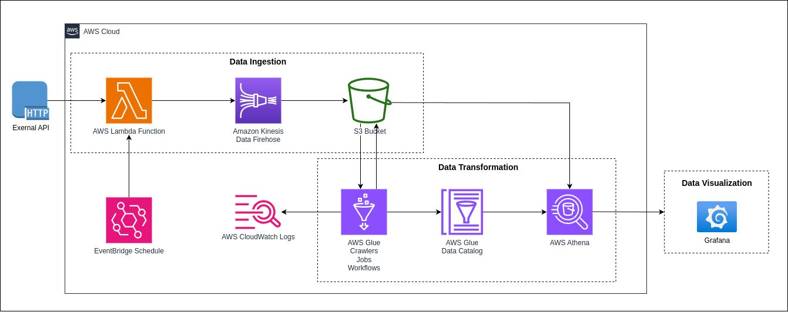

# Project FDEP-AWS: An Exploration of Learning ETL

Author: [Cleber Zumba](https://github.com/cleberzumba)

Last Updated: December 17, 2024

## What is this project for?
This project is a demonstration of how to utilize cloud services to create a data engineering project from scratch. The goals of creating this project include learning about various tools within Amazon Web Services (AWS), how they can be combined to create a compete workflow for extracting, transforming, and loading (ETL) data from online sources, and connect the transformed data to a tool for visualization. 

The main purpose of this project is to expand my knowledge and evolve as a data professional. I decided to align the project with my interests by exploring the Open-Meteo API, which provides weather data such as daily maximum and minimum temperatures. Analyzing weather information not only has practical applications, but also provides an excellent opportunity to improve API integration and data processing skills. This document does not focus on the technical aspects or the code, but rather presents an overview of the project, highlighting the tools used and the reasons that motivated their choice.

## Data Architecture

This project aims to create an automated and scalable data pipeline to collect, process, and visualize weather information. The data source is an external API that provides real-time weather information, such as temperature and geographic location.

The pipeline was developed using AWS managed services, ensuring a serverless and highly available architecture, with a focus on simplicity, performance, and scalability.

  - Extract: Lambda, Firehose, S3, Python, Athena
  - Transform: S3, Athena, Glue
  - Load: S3, Athena, Glue, Grafana
    

## API

This project uses data from the Open-Meteo [website](https://open-meteo.com/) API using the configured URL to collect weather information. The API returns daily maximum and minimum temperatures for Berlin, Germany, for the period June to November 2024.

### Fields Queryed in the URL:

The URL requested the following fields:

  - daily = temperature_2m_max,temperature_2m_min
      - temperature_2m_max: Daily maximum temperature.
      - temperature_2m_min: Daily minimum temperature.

### Campos Retornados pela API

A API retornou os dados no formato JSON, com os seguintes campos:

  - `latitude` (float): Latitude of the requested location (52.52).
  - `longitude` (float): Longitude of the requested location (13.41).
  - `generationtime_ms` (float): Time in milliseconds to generate the response.
  - `timezone` (string): Configured time zone (America/Los_Angeles).
  - `timezone_abbreviation` (string): Time zone abbreviation (e.g.: PDT).
  - `utc_offset_seconds` (integer): Offset in seconds relative to UTC time (-25200).
  - `daily.time` (array<string>): List of dates in ISO 8601 format (YYYY-MM-DD).
  - `daily.temperature_2m_max` (array<float>): List of daily maximum temperatures (in Fahrenheit, °F).
  - `daily.temperature_2m_min` (array<float>): List of daily minimum temperatures (in Fahrenheit, °F).
  - `daily_units` (object): Defines the unit of the returned variables (°F for temperatures).

## Extraction

Data extraction in a serverless environment is relatively straightforward. We need the following components:

Data extraction in a serverless environment is relatively straightforward. We need the following components:

  - **Storage:** AWS S3 is our primary service to store data, as it is both cost effective and plays well with the rest of the AWS tools.
  - **Collection:** Lambda utilizes Python code to call data from the Open-Meteo API using Python. For the purposes of this project, we use Lambda to post requests in an "on demand" basis, but it can be scheduled to run on a regular basis using an Event Bridge.
  - **Regulation:** Firehose enables us to collect data in situations where large amounts of data are constantly being called by Lambda and we wish to minimize computing costs to transfer the data. This particular tool is not necessary given the "on demand" nature of the project, but it is included for the sake of learning how to use it.
  - **Inspection:** Athena allows us to use SQL to examine the data being received and create a database structure to it.
